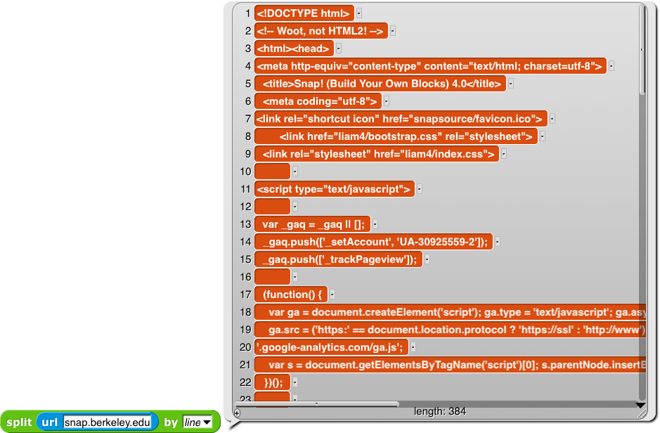

# The Outside World {#sec-ch09}

The facilities discussed so far are fine for projects that take place
entirely on your computer’s screen. But you may want to write programs
that interact with physical devices\index{devices} (sensors
\index{sensors} or robots\index{robots} ) or with the World Wide Web
\index{World Wide Web}. For these purposes [Snap]{.snap} provides a
single primitive block:

This might not seem like enough, but in fact it can be used to build the
desired capabilities.

## The World Wide Web

The input to the url block\index{url block} is the URL\index{URL} (Uniform
Resource Locator\index{Uniform Resource Locator}) of a web page. The
block reports the body of the Web server’s response (minus HTTP header),
*without interpretation.* This means that in most cases the response is
a description of the page in HTML\index{HTML} (HyperText Markup Language)
\index{HTML (HyperText Markup Language)} notation. Often, especially for
commercial web sites, the actual information you’re trying to find on
the page is actually at another URL included in the reported HTML. The
Web page is typically a very long text string, and so the primitive
split block\index{split block} is useful to get the text in a
manageable form, namely, as a list of lines:

 <!--  style="width:6.52083in;height:4.27778in" / -->

The second input to split is the character to be used to separate the
text string into a list of lines, or one of a set of common cases (such
as line, which separates on carriage return and/or newline characters.

This might be a good place for a reminder that list-view watchers scroll
through only 100 items at a time. The downarrow near the bottom right
corner of the speech balloon in the picture presents a menu of
hundred-item ranges. (This may seem unnecessary, since the scroll bar
should allow for any number of items, but doing it this way makes
[Snap]{.snap} much faster.) In table view, the entire list is included.

If you include a protocol name in the input to the url block (such as
`http://` or `https://`), that protocol will be used. If not, the block
first tries HTTPS\index{HTTPS} and then, if that fails, HTTP
\index{HTTP}.

A security restriction in JavaScript limits the ability of one web site
to initiate communication with another site. There is an official
workaround for this limitation called the CORS\index{CORS} protocol
(Cross-Origin Resource Sharing\index{Cross-Origin Resource Sharing}),
but the *target* site has to allow snap.berkeley.edu explicitly, and of
course most don’t. To get around this problem, you can use third-party
sites (“cors proxies\index{cors proxies}”) that are not limited by
JavaScript and that forward your requests.

<!-- TODO: Note that you must trust the CORS proxy that you use not to steal your data or modify the responses. -->

## Hardware Devices

Another JavaScript security restriction prevents [Snap]{.snap} from having
direct access to devices\index{devices} connected to your computer,
such as sensors and robots\index{robots}. (Mobile devices such as
smartphones may also have useful devices built in, such as
accelerometers and GPS receivers.) The url block is also used to
interface [Snap]{.snap} with these external capabilities.

The idea is that you run a separate program that both interfaces with
the device and provides a local HTTP server that [Snap]{.snap} can use to make
requests to the device. *Unlike* [Snap]{.snap} *itself, these programs have
access to anything on your computer, so you have to trust the author of
the software!* Our web site, snap.berkeley.edu, provides links to
drivers for several devices, including, at this writing, the Lego NXT
\index{Lego NXT}, Finch\index{Finch}, Hummingbird\index{Hummingbird}, and Parallax S2\index{Parallax S2} robots; the Nintendo
\index{Nintendo} Wiimote\index{Wiimote} and Leap Motion\index{Leap
Motion} sensors, the Arduino\index{Arduino} microcomputer, and
Super-Awesome Sylvia\index{Super-Awesome Sylvia} ’s Water Color Bot
\index{Water Color Bot}. The same server technique can be used for
access to third party software libraries, such as the speech synthesis
package linked on our web site.

Most of these packages require some expertise to install; the links are
to source code repositories. This situation will improve with time.

## Date and Time

The current \index{current block} block in the Sensing palette can be used to find
out the current date or time\index{current date or time}. Each call to
this block reports one component of the date\index{date} or time
\index{time}, so you will probably combine several calls, like this:

 <!--  style="width:5.30556in;height:0.31944in" alt="Macintosh HD:Users:bh:Desktop:date.png" / -->

for Americans, or like this:

 <!--  style="width:5.30556in;height:0.31944in" alt="Macintosh HD:Users:bh:Desktop:European-date.png" / -->

for Europeans.
