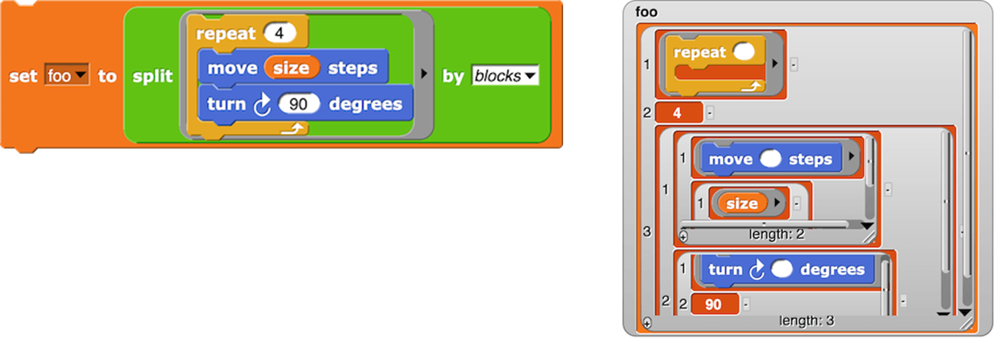
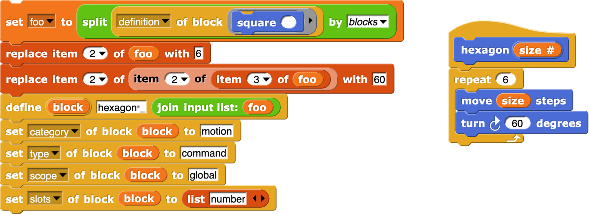
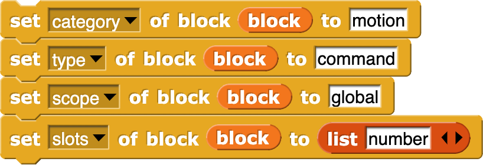
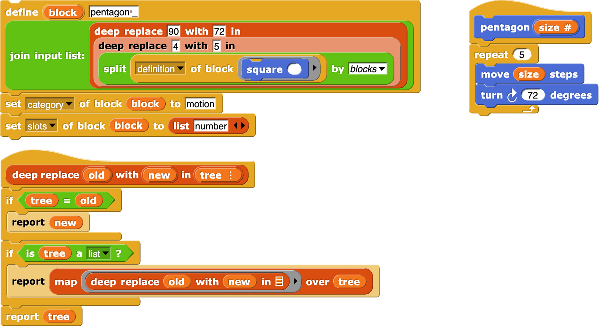
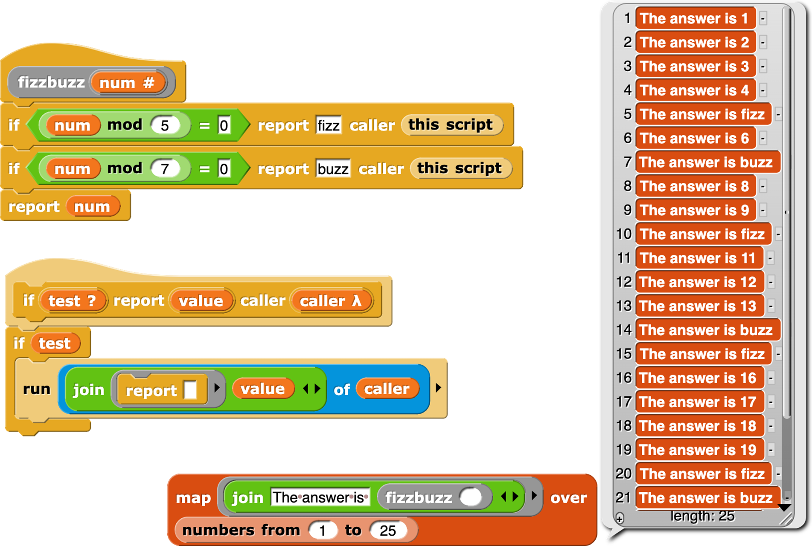

#  Metaprogramming

The scripts and custom blocks that make up a program can be examined or
created by the program itself.

## Reading a block

 <!--  style="width:1.15in;height:0.19in" alt="A picture containing text, hitting Description automatically generated" / -->

The definition of block\index{definition of block} takes a custom block
(in a ring, since it’s the block itself that’s the input, not the result
of calling the block) as input and reports the block’s definition, i.e.,
its inputs and body, in the form of a ring with named inputs
corresponding to the block’s input names, so that those input names are
bound in the body.

The split by blocks block\index{split by blocks block} takes any
expression or script as input (ringed) and reports a list representing a
*syntax tree* for the script or expression, in which the first item is a
block with no inputs and the remaining items are the input values, which
may themselves be syntax trees.

 <!--  style="width:1.15in;height:0.19in" alt="A picture containing text, hitting Description automatically generated" / -->

Using split by blocks to select custom blocks whose definitions contain
another block gives us this debugging aid:

 <!--  style="width:1.15in;height:0.19in" alt="A picture containing text, hitting Description automatically generated" / -->

Note in passing the my blocks block\index{my blocks block}, which
reports a list of all visible blocks, primitive and custom. (There’s
also a my categories block\index{my categories block}, which reports a
list of the names of the palette categories.) Also note custom? of block
\index{custom? of block block}, which reports True if its input is a
custom block.

## Writing a block

The inverse function to split by blocks is provided by the join block
\index{join block}, which when given a syntax tree as input reports the
corresponding expression or script.

 <!--  style="width:1.15in;height:0.19in" alt="A picture containing text, hitting Description automatically generated" / -->

Here we are taking the definition of square, modifying the repetition
count (to 6), modifying the turning angle (to 60), using join to turn
the result back into a ringed definition, and using the define block
\index{define block} to create a new hexagon block.

The define block has three “input” slots. The quotation marks are there
because the first slot is an upvar, i.e., a way for define to provide
information to its caller, rather than the other way around. In this
case, the value of block is the new block itself (the hexagon block, in
this example). The second slot is where you give the *label* for the new
block. In this example, the label is “hexagon \_” in which the
underscore represents an input slot. So, here are a few examples of
block label\index{block label} s:

set pen \_ to \_

for \_ = \_ to \_ \_

ask \_ and wait

\_ of \_

Note that the underscores are separated from the block text by spaces.
Note in the case of the for block’s label that the upvar (the i) and the
C-slot both count as inputs. Note also that the label is not meant to be
a unique symbol that represents only this block. For example,
 <!--  style="width:0.86111in;height:0.19444in" / -->  and
 <!--  style="width:1.15in;height:0.19in" alt="A picture containing text, hitting Description automatically generated" / -->
both have the label

\_ of \_. The label does not give the input slots names (that’s done in
the body, coming next) or types (that’s done in the set \_ of block \_
to \_ block\index{set \_ of block \_ to \_ block}, coming in two
paragraphs).

The third slot is for the *definition*\index{definition (of block)} of
the new block. This is a (ringed) script whose input names (formal
parameters) will become the formal parameters of the new block. And the
script is its script.

So far we know the block’s label, parameters, and script. There are
other things to specify about the block, and one purpose of the block
upvar is to allow that. In the example on the previous page, there are
four set
\_ of block \_ to \_ blocks, reproduced below for your convenience:

 <!--  style="width:2.83in;height:0.97in" alt="Graphical user interface, website Description automatically generated" / -->

The category of the block can be set to any primitive or custom
category. The default is other. The type is command, reporter, or
predicate. Command is the default, so this setting is redundant, but we
want to show all the choices in the set block. The scope is either
global or sprite, with global as the default. The last input to set
slots is a list of length less than or equal to the number of
underscores in the label. Each item of the list is a type name, like the
ones in the is (5) a (number)? block. If there is only one input, you
can use just the name instead of putting it in a list. An empty or
missing list item means type Any.

It's
very important that these set blocks appear in the same script as the
define that creates the block, because the block upvar is local to that
script. You can’t later say, for example,

 <!--  style="width:4.31in;height:0.83in" alt="Graphical user interface, text, application, chat or text message Description automatically generated" / -->

because the copy of the hexagon block in this instruction counts as
“using” it.

 <!--  style="width:2.6in;height:0.32in" / -->

The of
block reporter is useful to copy attributes from one block to another,
as we copied the definition of square, modified it, and used it to
define hexagon. Some of the values this block reports are a little
unfriendly:

“1”? Yes, this block reports *numbers* instead of names for category,
type, and scope. The reason is that maybe someday we’ll have
translations to other languages for custom category names, as we already
do for the built-in categories, types, and scopes; if you translate a
program using this block to another language, the numeric outputs won’t
change, simplifying comparisons in your code. The set block accepts
these numbers as an alternative to the names.

There
are a few more attributes of a block, less commonly used.

 <!--  style="width:3.37986in;height:0.37986in" / -->  <!--  style="width:1.02in;height:0.25in" alt="A picture containing text, clipart Description automatically generated" / -->

The
list input is just like the one for set slots except for default values
instead of types. Now for a block with a menu input:

 <!--  style="width:3.29097in;height:0.60972in" / -->

 <!--  style="width:2.35in;height:2.56in" alt="Graphical user interface, application Description automatically generated" / -->

 <!--  style="width:1.66944in;height:0.25in" alt="Graphical user interface, text, application Description automatically generated" / -->

Prefer a read-only menu?

 <!--  style="width:3.51944in;height:0.61944in" alt="Graphical user interface, text, website Description automatically generated" / -->

 <!--  style="width:1.66944in;height:0.25in" alt="Graphical user interface, text, application Description automatically generated" / -->

We
passed too quickly over how the script turned the square block into a
hexagon block:

 <!--  style="width:4.16944in;height:1.26944in" alt="Graphical user interface, website Description automatically generated" / -->

Those replace item blocks aren’t very elegant. I had to look at foo by
hand to figure out where the numbers I wanted to change are. This
situation can be improved with a little programming:

 <!--  style="width:4.16944in;height:1.26944in" alt="Graphical user interface, website Description automatically generated" / -->

Exercise for the reader: Implement
this:

 <!--  style="width:3.11in;height:0.57in" alt="Graphical user interface Description automatically generated" / -->

Returning to the define block, there’s another reason for the block
upvar: It’s helpful in defining a recursive procedure using define
\index{recursive procedure using define}. For a procedure to call
itself, it needs a name for itself. But in the definition input to the
define block, define itself hasn’t been called yet, so the new block
isn’t in the palette yet. So you do this:

 <!--  style="width:3.11in;height:0.57in" alt="Graphical user interface Description automatically generated" / -->

Yes, you put block in the define, but it gets changed into this script
in the resulting definition.

 <!--  style="width:3.11in;height:0.57in" alt="Graphical user interface Description automatically generated" / -->

 <!--  style="width:3.11in;height:0.57in" alt="Graphical user interface Description automatically generated" / -->

 <!--  style="width:3.11in;height:0.57in" alt="Graphical user interface Description automatically generated" / -->

You could use this script directly in a
simple case like this, but in a complicated case with a recursive call
inside a ring inside the one giving the block definition, this script
always means the innermost ring. But the upvar means the outer ring;
note how the definition of blockify automatically creates a script
variable to hold the outer environment.

It’s analogous to using explicit formal parameters when you nest calls
to higher order functions.

Note: Ordinarily, when you
call a function that reports a (ringed) procedure, that procedure was
created in some specific environment, and has access to that
environment’s variables. This is how instance variables (fields) work in
object oriented programming (Chapter VIII). But the procedures made by
join of a syntax tree have no associated environment, not even the one
containing global variables. That doesn’t matter if the procedure will
use only its own input variables, but for access to other variables, use

## Macros

 <!--  style="width:3.11in;height:0.57in" alt="Graphical user interface Description automatically generated" / -->

Users of languages in the C family have learned to think of macros as
entirely about text strings, with no relation to the syntax of the
language. So you can do things like

\#define foo baz)

with the result that you can only use the foo macro after an open
parenthesis.

In the Lisp family of languages we have a different tradition, in which
macros\index{macros} are syntactically just like procedure calls,
except that the “procedure” is a macro, with different evaluation rules
from ordinary procedures. Two things make a macro different: its input
expressions are not evaluated, so a macro can establish its own syntax
(but still delimited by parentheses, in Lisp, or still one block, in
[Snap]{.snap} ); and the result of a macro call is a new expression that is
evaluated *as if it appeared in the caller* of the macro, with access to
the caller’s variables and, implicitly, its continuation.

[Snap]{.snap} has long had the first part of this, the ability to make inputs
unevaluated. In version 8.0 we add the ability to run code in the
context of another procedure, just as we can run code in the context of
another sprite, using the same mechanism: the of block\index{of block
(sensing)} . In the example on the previous page, the if \_ report \_
caller \_ block runs a report block, but not in its own context; it
causes *the fizzbuzz block* to report “fizz” or “buzz” as appropriate.
(Yes, we know that the rules implemented here are simplified compared to
the real game.) It doesn’t just report out of the entire toplevel
script; you can see that map is able to prepend “The answer is” to each
reported value.

 <!--  style="width:3.03958in;height:0.23958in" / -->

This macro capability isn’t fully implemented. First, we shouldn’t have
to use the calling script as an explicit input to the macro. In a later
release, this will be fixed; when defining a block you’ll be able to say
that it’s a macro, and it will automatically get its caller’s context as
an invisible input. Second, there is a possibility of confusion between
the variables of the macro and the variables of its caller. (What if the
macro wanted to refer to a variable value in its caller?) The one
substantial feature of Scheme that we don’t yet implement is *hygienic
macros,* which make it possible to keep the two namespaces separate.
