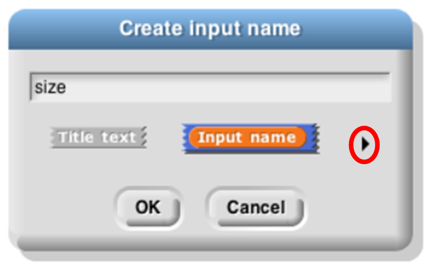
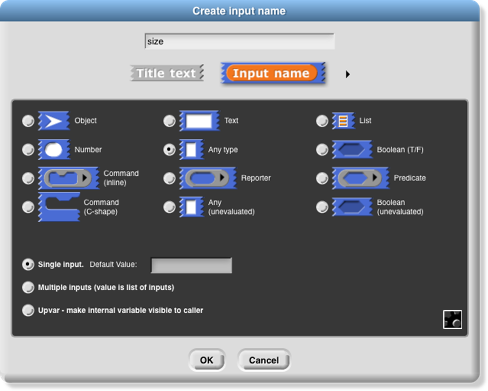
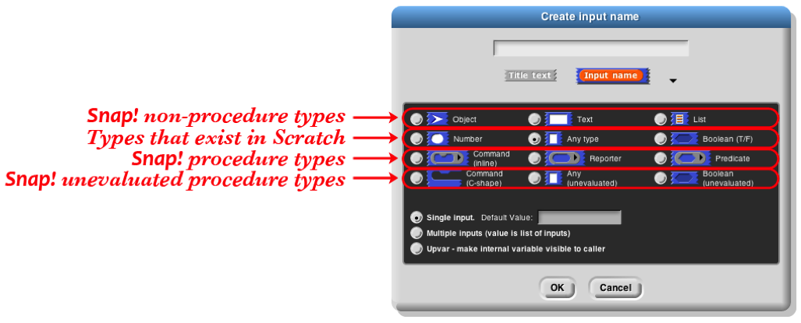
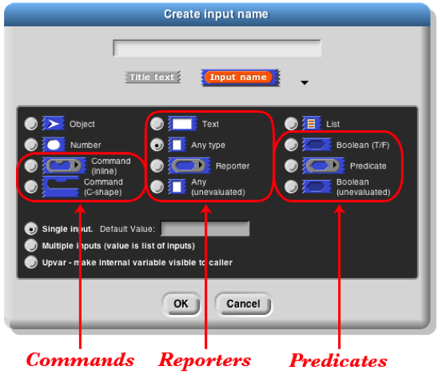
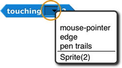
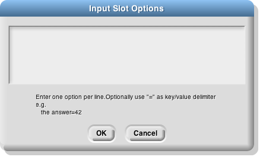
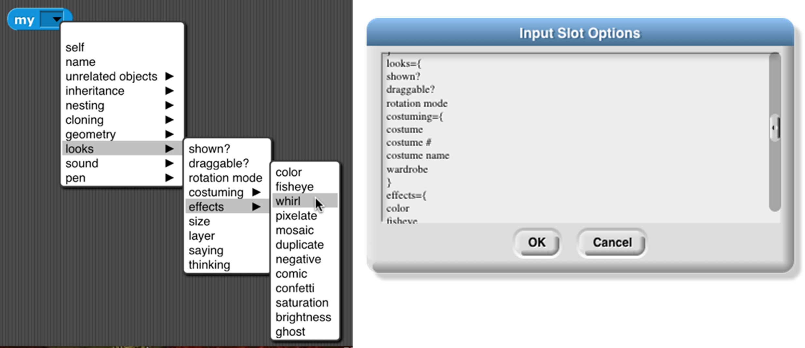
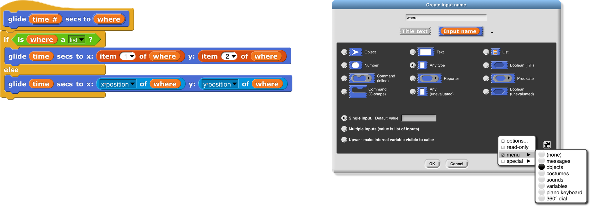
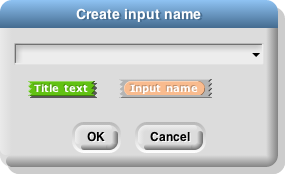
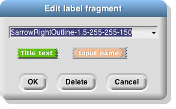

#  Typed Inputs

##  Scratch’s Type Notation

 Prior
to version 3, Scratch\index{Scratch} block inputs came in two types
\index{data type} : Text-or-number type and Number type. The former is
indicated by a rectangular box, the latter by a rounded box:  <!--  style="width:1.375in;height:0.2125in" / -->. A third
Scratch type, Boolean (true/false), can be used in certain Control
blocks with hexagonal slots.

The [Snap]{.snap} types are an expanded collection including Procedure, List,
and Object types. Note that, with the exception of Procedure types, all
of the input type shapes are just reminders to the user of what the
block expects; they are not enforced by the language.

## The [Snap]{.snap} Input Type Dialog

In the Block Editor\index{Block Editor} input name dialog\index{input
name dialog} , there is a right-facing arrowhead after the “Input name”
option:

 <!--  style="width:5.17083in;height:4.13542in" / -->

Clicking that arrowhead opens the “long” input name dialog\index{long
input name dialog} :

 <!--  style="width:5.17083in;height:4.13542in" / -->

There are twelve input type
shapes\index{input-type shapes}, plus three mutually exclusive
modifiers, listed in addition to the basic choice between title text and
an input name. The default type, the one you get if you don’t choose
anything else, is “Any,” meaning that this input slot is meant to accept
any value of any type\index{Any type}. If the size input in your block
should be an oval-shaped numeric slot rather than a generic rectangle,
click “Number.”

The arrangement of the input
types is systematic. As the pictures on this and the next page show,
each row of types is a category, and parts of each column form a
category. Understanding the arrangement will make it a little easier to
find the type you want.

 <!--  style="width:6.82222in;height:2.75694in" / -->

The second row of input types
contains the ones found in Scratch: Number, Any, and Boolean. (The
reason these are in the second row rather than the first will become
clear when we look at the column arrangement.) The first row contains the
new [Snap]{.snap} types other than procedures: Object, Text, and List. The
last two rows are the types related to procedures, discussed more fully
below.

The List type\index{List type} is used for first class lists, discussed
in Chapter IV above. The red rectangles inside the input slot are meant
to resemble the appearance of lists as [Snap]{.snap} displays them on the
stage: each element in a red rectangle.

The Object type\index{Object type} is for sprites, costumes, sounds,
and similar data types.

The Text type\index{Text type} is really just a variant form of the Any
type, using a shape that suggests a text input.[5]

### Procedure Types

Although the procedure types are discussed more fully later, they are
the key to understanding the column arrangement in the input types. Like
Scratch, [Snap]{.snap} has three block shapes\index{block shapes} :
jigsaw-piece\index{jigsaw-piece blocks} for command blocks, oval
\index{oval blocks} for reporters, and hexagonal\index{hexagonal
blocks} for predicates. (A *predicate* is a reporter that always reports
true or false.) In [Snap]{.snap} these blocks are first class data; an input to
a block can be of Command type, Reporter type, or Predicate type. Each
of these types is directly below the type of value that that kind of
block reports, except for Commands, which don’t report a value at all.
Thus, oval Reporters are related to the Any type, while hexagonal
Predicates are related to the Boolean (true or false) type.

The unevaluated procedure types\index{unevaluated procedure types} in
the fourth row are explained in Section VI.E below. In one handwavy
sentence, they combine the *meaning* of the procedure types with the
*appearance* of the reported value types two rows higher. (Of course,
this isn’t quite right for the C-shaped command input type, since
commands don’t report values. But you’ll see
later that it’s true in spirit.)

 <!--  style="width:3.64583in;height:3.11389in" / -->

### Pulldown inputs

Certain primitive blocks have
*pulldown* inputs\index{pulldown input}, either *read-only*
\index{read-only pulldown input} *,* like the input to the touching
block:

 <!--  style="width:1.68056in;height:0.94097in" / -->

(indicated by the input slot
being the same (cyan, in this case) color as the body of the block), or
*writeable*\index{writeable pulldown inputs} *,* like the input to the
point in direction block:

 <!--  style="width:1.90208in;height:1.32292in" / -->

(indicated by the white input slot), which means that the user can type
in an arbitrary input instead of using the pulldown menu.

 <!--  style="width:0.83264in;height:0.65278in" / -->

Custom blocks can
also have such inputs. To make a pulldown input, open the long form
input dialog, choose a text type (Any, Text, or Number) and click the   <!--  style="width:0.13194in;height:0.13194in" alt="Macintosh HD:Users:bh:Desktop:gear-part.png" / -->
icon in the bottom right corner, or control/right-click in the dialog.
You will see this menu:

 Click
the read-only checkbox if you want a read-only pulldown input. Then from
the same menu, choose options… to get this dialog box:

 <!--  style="width:3.07639in;height:1.875in" / -->

Each line in the text box represents one menu item. If the line does not
contain any of the characters =~{} then the text is both what’s shown in
the menu and the value of the input if that entry is chosen.

If the line contains an equal sign =, then the text to the left of the
equal sign is shown in the menu, and the text to the right is what
appears in the input slot if that entry is chosen, and is also the value
of the input as seen by the procedure.

If the line consists of a tilde ~, then it represents a separator
\index{separator:menu} (a horizontal line) in the menu, used to divide
long menus into visible categories. There should be nothing else on the
line. This separator is not choosable, so there is no input value
corresponding to it.

If the line ends with the two characters equal sign and open brace ={,
then it represents a *submenu.* The text before the equal sign is a name
for the submenu\index{submenu}, and will be displayed in the menu with
an arrowhead ► at the end of the line. This line is not clickable, but
hovering the mouse over it displays the submenu next to the original
menu. A line containing a close brace } ends the submenu; nothing else
should be on that line. Submenus may be nested to arbitrary depth.

 <!--  style="width:3.07639in;height:1.875in" / -->

Alternatively, instead of giving a menu listing as described above, you
can put a JavaScript function that returns the desired menu in the
textbox. This is an experimental feature and requires that JavaScript be
enabled in the Settings menu.
It is also possible to get the special menus used in some primitive
blocks, by choosing from the menu submenu: broadcast messages, sprites
and stage, costumes, sounds, variables that can be set in this scope,
the play note piano keyboard, or the point in direction 360° dial.
Finally, you can make the input box accept more than one line of text
(that is, text including a newline character) from the special submenu,
either “multi-line” for regular
text or “code”
for monospace-font computer code.

 If the
input type is something other than text, then clicking the  <!--  style="width:0.13056in;height:0.1375in" alt="Macintosh HD:Users:bh:Desktop:quarter-gear.png" / --> button will
instead show this menu:

 <!--  style="width:0.60417in;height:0.31944in" alt="Macintosh HD:Users:bh:Desktop:little-options.png" / -->

As an example, we want to make this block:  <!--  style="width:0.60417in;height:0.31944in" alt="Macintosh HD:Users:bh:Desktop:little-options.png" / -->  The second input must be a
read-only object menu:

 <!--  style="width:0.60417in;height:0.31944in" alt="Macintosh HD:Users:bh:Desktop:little-options.png" / -->

### Input variants

We now turn to the three mutually exclusive options that come below the
type array.

The “single input” option: In Scratch, all inputs are in this category.
There is one input slot in the block as it appears in its palette. If a
single input is of type Any, Number, Text, or Boolean, then you can
specify a default value\index{default value} that will be shown in that
slot in the palette, like the “10” in the move (10) steps block. In the
prototype block at the top of the script in the Block editor, an an input with
name “size” and default value 10 looks like this:

 <!--  style="width:1.63889in;height:0.52083in" alt="Macintosh HD:Users:bh:Desktop:default-value.png" / -->

 <!--  style="width:1.76389in;height:0.93056in" / -->

The “Multiple inputs” option:
The list block introduced earlier accepts any number of inputs to
specify the items of the new list. To allow this, [Snap]{.snap} introduces the
arrowhead notation (⏴⏵) that expands and contracts the block, adding and
removing input slots. (Shift-clicking on an arrowhead adds or removes
three input slots at once.) Custom blocks made by the [Snap]{.snap} user have
that capability, too. If you choose the “Multiple inputs” button, then
arrowheads\index{arrowheads} will appear after the input slot in the
block. More or fewer slots (as few as zero) may be used. When the block
runs, all of the values in all of the slots for this input name are
collected into a list, and the value of the input as seen inside the
script is that list of values:

The ellipsis\index{ellipsis} (…) in the orange input slot name box in
the prototype indicates a multiple or *variadic* input\index{variadic
input} .

The third category, “Upvar - make internal variable\index{internal
variable} visible to caller\index{make internal variable visible},”
isn’t really an input at all, but rather a sort of output from the block
to its user. It appears as an orange variable oval in the block, rather
than as an input slot. Here’s an example; the uparrow (**↑**)
\index{upward-pointing arrow} in the prototype indicates this kind of
internal variable name:

 <!--  style="width:1.76389in;height:0.93056in" / -->

The variable i (in the block on the right above) can be dragged from the
for block\index{for block} into the blocks used in its C-shaped command
slot. Also, by clicking on the orange i, the user can change the name of
the variable as seen in the calling script (although the name hasn’t
changed inside the block’s definition). This kind of variable is called
an *upvar*\index{upvar} for short, because it is passed *upward* from
the custom block to the script that uses it.

Note about the example: for is a primitive block, but it doesn’t need to
be. You’re about to see (next chapter) how it can be written in [Snap]{.snap}.
Just give it a different name to avoid confusion, such as my for as
above.

### Prototype Hints

We have mentioned three notations that can appear in an input slot in
the prototype to remind you of what kind of input this is. Here is the
complete list of such notations:

 <!--  style="width:0.73472in;height:6.11806in" / -->

- = default value
- … multiple input
- ↑ upvar
- \# number
- λ procedure types
- ⫶ list
- ? Boolean
- ¶ multi-line text
-  <!--  style="width:0.16319in;height:0.13542in" / --> object

### Title Text and Symbols

Some primitive blocks have
symbols\index{icons in title text} as part of the block name:  <!--  style="width:1.21875in;height:0.23472in" / -->. Custom
blocks can use symbols too. In the Block Editor, click the plus sign in
the prototype at the point where you want to insert the symbol. Then
click the title text picture below the text box that’s expecting an
input slot name. The dialog will then change to look like this:

  <!--  style="width:2.03472in;height:1.26389in" / -->

The important part to notice
is the arrowhead that has appeared at the right end of the text box.
Click it to see the menu shown here at the left.

Choose one of the symbols. The result will have the symbol you want:  <!--  style="width:1.24444in;height:0.26667in" / --> The
available symbols are, pretty much, the ones that are used in [Snap]{.snap}
icons.

 But I’d like the arrow symbol
bigger, and yellow, so I edit its name:

 <!--  style="width:2.03472in;height:1.26389in" / -->

 This makes the symbol 1.5
times as big as the letters in the block text, using a color with
red-green-blue values of 255-255-150 (each between 0 and 255). Here’s
the result:

 <!--  style="width:1.19792in;height:0.27083in" / -->

The size and color controls can also be used with text: $foo-8-255-120-0
will make a huge orange “foo.”

Note the last entry in the symbol menu: “new line\index{new line
character} .” This can be used in a block with many inputs to control
where the text continues on another line, instead of letting [Snap]{.snap}
choose the line break itself.
